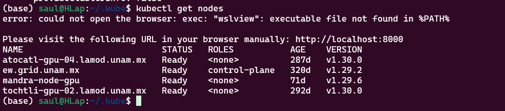

# Clúster de supercómputo CUDI y kokkos-ecosystem


## ¿Qué es CUDI?

La Corporación Universitaria para el Desarrollo de Internet (CUDI), es una asociación civil sin fines de lucro que gestiona la Red Nacional de Educación e Investigación (RNEI) para promover el desarrollo de nuestro país y aumentar la sinergia entre sus integrantes. CUDI fue fundada en abril de 1999 y es el organismo que busca impulsar el desarrollo de aplicaciones que utilicen esta red, fomentando la colaboración en proyectos de investigación y educación entre sus miembros.
Administrar, promover y desarrollar la Red Nacional de Investigación y Educación (RNIE) de México y aumentar la sinergia entre sus integrantes.

### GRID de supercómputo

El proyecto “Construcción de una Grid Interinstitucional en México” ha tenido como objetivo primordial la construcción de una grid que sirva como infraestructura de pruebas para el desarrollo de tecnologías de grids a nivel nacional. Dicho objetivo ha sido alcanzado, de modo que existe en la actualidad la Grid Académica Mexicana (GRAMA), lista para ser utilizada como la infraestructura de pruebas mencionada anteriormente. 

Como grid entendemos una infraestructura de hardware, software y comunicaciones que permite la integración de equipos de cómputo localizados en diferentes sitios geográficos, y que pueden ser utilizados de manera compartida y transparente por una comunidad específica. En GRAMA, la infraestructura de hardware ha sido constituida a partir de equipos de cómputo en cada una de las instituciones participantes; la infraestructura de software ha sido constituida a partir de los estándares actuales de construcción de grids y de acuerdo a necesidades generales de las comunidades participantes; la infraestructura de comunicaciones utilizada ha sido la red CUDI y las infraestructuras de red locales propias de las comunidades participantes.

## Kokkos ecosystem

Kokkos es una biblioteca en C++ diseñada para facilitar la programación paralela. Permite desarrollar aplicaciones que se ejecutan de forma eficiente en múltiples arquitecturas, como CPUs y GPUs, a través de una abstracción que oculta la complejidad del hardware.

Kokkos fue desarrollado inicialmente en Sandia National Laboratories y cuenta con el respaldo de la comunidad HPC. Forma parte de un ecosistema más amplio que incluye otras herramientas y librerías, destinadas a simplificar la programación paralela.
Forma parte del Proyecto Exascale del Departamento de Energía de EE.UU., la principal iniciativa estadounidense para preparar a la comunidad de HPC para la próxima generación de plataformas de supercomputación.

### Machine Model

Este “machine model” tiene dos componenets importantes:
Espacios de memoria, en donde pueden ser guardadas las estructuras de datos
Espacios de ejecución, los cuales ejecutan operaciones paralelas usando datos de uno o más espacios de memoria

### Programming model

El modelo de programación Kokkos se caracteriza por 6 abstracciones básicas:
Espacios de Ejecución
Patrones de Ejecución
Políticas de Ejecución
Espacios de Memoria
Disposición de Memoria 
Rasgos de Memoria. 
Estos conceptos de abstracción permiten formular algoritmos y estructuras de datos genéricos que pueden adaptarse a distintos tipos de arquitecturas. En efecto, permiten transformar algoritmos en tiempo de compilación para adaptarlos a distintos grados de paralelismo de hardware, así como a la jerarquía de memoria.

> [!TIP]
> Para mayor información visita la documentación [aquí](https://kokkos.org/kokkos-core-wiki/ProgrammingGuide/Introduction.html)

### Función programada usando kokkos

```c++
void matrixMultiply(const int n) {
    Kokkos::View<double**> A("A", n, n);
    Kokkos::View<double**> B("B", n, n);
    Kokkos::View<double**> C("C", n, n);

    Kokkos::parallel_for("InitializeA", n, KOKKOS_LAMBDA(const int i) {
        for (int j = 0; j < n; ++j) {
            A(i, j) = static_cast<double>(i + j);
            B(i, j) = static_cast<double>(i - j);
        }
    });

    auto start = std::chrono::high_resolution_clock::now();

    Kokkos::parallel_for("MatrixMultiply",
        Kokkos::MDRangePolicy<Kokkos::Rank<2>>({0, 0}, {n, n}),
        KOKKOS_LAMBDA(const int i, const int j) {
            double sum = 0.0;
            for (int k = 0; k < n; ++k) {
                sum += A(i, k) * B(k, j);
            }
            C(i, j) = sum;
        }
    );

    Kokkos::fence();

    auto end = std::chrono::high_resolution_clock::now();
    std::chrono::duration<double> duration = end - start;

    std::cout << "Tiempo de ejecución: " << duration.count() << " segundos\n";
}
```

Vamos a indagar en ella:

```c++
void matrixMultiply(const int n) {
```
Se define una función llamada matrixMultiply que recibe un parámetro entero n. Este parámetro representa el tamaño (dimensión) de las matrices cuadradas que se van a multiplicar. Es decir, se trabajará con matrices de dimensión n×n.
```c++
Kokkos::View<double**> A("A", n, n);
Kokkos::View<double**> B("B", n, n);
Kokkos::View<double**> C("C", n, n);
```
Aquí se declaran tres variables de tipo Kokkos::View<double**>, que son contenedores de datos en dos dimensiones (matrices) de tipo double.

- A("A", n, n): Se crea la matriz A con el identificador "A" y dimensiones n×n.
- B("B", n, n): Se crea la matriz B de igual forma, con identificador "B".
- C("C", n, n): Se crea la matriz C, que almacenará el resultado de la multiplicación de A y B.

Estas vistas permiten que la misma estructura se utilice en diferentes espacios de memoria (por ejemplo, CPU o GPU) según se requiera.

Memory Spaces y Memory Layout (y, por defecto, Memory Traits):
- Memory Spaces:
Las vistas (Kokkos::View) permiten ubicar los datos en distintos espacios de memoria (por ejemplo, memoria del host o del dispositivo).
- Memory Layout:
Aunque no se especifica explícitamente un layout (como Kokkos::LayoutLeft o Kokkos::LayoutRight), las vistas usan un layout predeterminado para mapear índices lógicos a posiciones físicas en memoria.
- Memory Traits:
Los traits por defecto determinan cómo se accede a los datos (por ejemplo, en forma de acceso aleatorio). Si se necesitaran características específicas (como acceso atómico), se podrían aplicar traits adicionales.
```c++
 Kokkos::parallel_for("InitializeA", n, KOKKOS_LAMBDA(const int i) {
```
Se utiliza la función Kokkos::parallel_for para inicializar las matrices A y B.

- El string "InitializeA" es una etiqueta que identifica este bloque de ejecución paralela.
- El segundo parámetro n indica que el bucle se ejecutará con i tomando valores de 0 hasta n-1, de forma paralela.
- KOKKOS_LAMBDA(const int i) define una función lambda (anónima) que se ejecutará para cada iteración, donde i representa la fila de las matrices que se está inicializando.

Execution Patterns y Execution Policies:
- Execution Pattern:
Se utiliza el patrón parallel_for para ejecutar iteraciones en paralelo, sin un orden predefinido, lo que permite al runtime asignar las iteraciones a hilos o vectores según la arquitectura.
- Execution Policy:
Aquí se emplea una Range Policy (implícita) para iterar desde 0 hasta n–1 (en un solo rango), distribuyendo las iteraciones de manera simple y sin jerarquía.
```c++
for (int j = 0; j < n; ++j) {
```
Dentro de la lambda, se define un bucle for convencional que recorre cada columna j de la fila i de las matrices. Esto significa que para cada fila (procesada en paralelo), se recorre secuencialmente cada columna desde 0 hasta n-1.
```c++
A(i, j) = static_cast<double>(i + j);
```
En cada iteración del bucle interno, se asigna a la posición (i, j) de la matriz A el valor de i + j, convertido a double.

- static_cast<double>(i + j) se utiliza para asegurar que la suma se convierta al tipo double, garantizando la compatibilidad de tipos.
```c++
B(i, j) = static_cast<double>(i - j);
```
Similarmente, en la misma iteración se asigna a la posición (i, j) de la matriz B el valor de i - j, también convertido a double.

- La elección de i - j para B es simplemente parte de la inicialización; podría ser cualquier otro valor, pero en este ejemplo se utiliza para que las matrices tengan datos diferentes y se pueda observar la multiplicación.

```c++
auto start = std::chrono::high_resolution_clock::now();
```
Se registra el tiempo actual usando std::chrono::high_resolution_clock::now(). Esto sirve para medir el tiempo transcurrido durante la ejecución del kernel de multiplicación de matrices. La variable start contendrá el instante inicial.
```c++
Kokkos::parallel_for("MatrixMultiply",
Kokkos::MDRangePolicy<Kokkos::Rank<2>>({0, 0}, {n, n}),
KOKKOS_LAMBDA(const int i, const int j) {
```
Se invoca Kokkos::parallel_for para ejecutar el kernel de multiplicación de matrices en paralelo.

- La etiqueta "MatrixMultiply" identifica esta operación.
- Se utiliza Kokkos::MDRangePolicy<Kokkos::Rank<2>>({0, 0}, {n, n}), lo que define un rango bidimensional para los índices i y j, abarcando todas las combinaciones en una matriz de tamaño n×n.
- La función lambda KOKKOS_LAMBDA(const int i, const int j) recibe los índices i y j, que representan la posición en la matriz resultante donde se almacenará el resultado del producto.

Execution Patterns y Execution Policies:
- Execution Pattern:
Nuevamente se utiliza el patrón parallel_for para distribuir la carga de trabajo en paralelo.
- Execution Policy:
Se emplea aquí una MDRangePolicy (política de rango multidimensional) que define un dominio 2D, permitiendo un mapeo más directo de la estructura de datos (matrices) a la ejecución paralela.

```c++
double sum = 0.0;
for (int k = 0; k < n; ++k) {
    sum += A(i, k) * B(k, j);
}
```
Dentro de la lambda, se declara una variable sum inicializada a 0.

- Se inicia un bucle for con la variable k que recorre de 0 hasta n-1.
- En cada iteración se calcula el producto del elemento de la fila i de la matriz A (posición A(i, k)) por el elemento de la columna j de la matriz B (posición B(k, j)).
- Estos productos se acumulan en la variable sum, lo que representa el cálculo del producto escalar entre la fila de A y la columna de B.
```c++
C(i, j) = sum;
```
Una vez finalizado el bucle for (que recorre el índice k), la suma total sum se asigna a la posición (i, j) de la matriz C. Esto completa el cálculo de un elemento de la matriz resultado.

Se cierra la lambda y el llamado a Kokkos::parallel_for, lo que significa que la operación de multiplicación se aplica a todas las posiciones (i, j) de la matriz en paralelo.
```c++
Kokkos::fence();
```
La llamada a Kokkos::fence() es crucial para sincronizar las operaciones. Se asegura que todas las tareas lanzadas en el parallel_for hayan finalizado antes de avanzar en el código. Esto garantiza que la medición del tiempo incluya todas las operaciones de multiplicación.
```c++
auto end = std::chrono::high_resolution_clock::now();
std::chrono::duration<double> duration = end - start;
```
Se registra el tiempo de finalización en la variable end utilizando nuevamente std::chrono::high_resolution_clock::now().

La diferencia entre end y start se almacena en la variable duration como un objeto de std::chrono::duration<double>, que contiene la duración total de la operación en segundos.
```c++
std::cout << "Tiempo de ejecución: " << duration.count() << " segundos\n";
```
Finalmente, se utiliza std::cout para imprimir en la consola el tiempo de ejecución, accediendo al valor numérico a través del método duration.count().

Esto permite al usuario ver cuánto tiempo tomó realizar la multiplicación de matrices en la ejecución paralela.

## Práctica

### Requerimentos

- kubectl
- kubelogin o oidc-login

### Instalación


**Kubectl**
```bash
V=`curl -L -s https://dl.k8s.io/release/stable.txt`
curl -LO "https://dl.k8s.io/release/$V/bin/linux/amd64/kubectl”
```
curl -LO "https://dl.k8s.io/release/$(curl -L -s https://dl.k8s.io/release/stable.txt)/bin/linux/amd64/kubectl"
sudo install -o root -g root -m 0755 kubectl /usr/local/bin/kubectl
kubectl version --client
```bash
chmod a+x ./kubectl
```
```bash
cp ./kubectl /usr/bin
```
```bash
kubectl version --client
```
**Krew (manejador de plugins de kubectl)**
```bash
(
  set -x; cd "$(mktemp -d)" &&
  OS="$(uname | tr '[:upper:]' '[:lower:]')" &&
  ARCH="$(uname -m | sed -e 's/x86_64/amd64/' -e 's/\(arm\)\(64\)\?.*/\1\2/' -e 's/aarch64$/arm64/')" &&
  KREW="krew-${OS}_${ARCH}" &&
  curl -fsSLO "https://github.com/kubernetes-sigs/krew/releases/latest/download/${KREW}.tar.gz" &&
  tar zxvf "${KREW}.tar.gz" &&
  ./"${KREW}" install krew
)
```
```bash
export PATH="${KREW_ROOT:-$HOME/.krew}/bin:$PATH"
```
**kubelogin/oidc-login**
```bash
kubectl krew install oidc-login
```

### Configuración

Crear la carpeta .kube en home
```bash
mkdir ~/.kube
```
Crear el archivo config en  ~/.kube/config con el siguiente contenido

> [!CAUTION]
> Se pide total discresión con la información etiquetada como sensible

> [!NOTE]
> Este yaml se usa cuando usas WSL
```yaml
apiVersion: v1
clusters:
- cluster:
    certificate-authority: certs/pmiia/k8s-ca.crt
    server: https://132.248.194.163:6443
  name: kubernetes
contexts:
- context:
    cluster: kubernetes
    user: oidc
  name: oidc@kubernetes
current-context: oidc@kubernetes
kind: Config
preferences: {}
users:
- name: oidc
  user:
    exec:
      apiVersion: client.authentication.k8s.io/v1beta1
      command: kubectl-oidc_login.exe
      args:
      - get-token
      - --oidc-issuer-url=***
      - --oidc-client-id=***
      - --oidc-client-secret=***
      - --browser-command=wslview
      interactiveMode: IfAvailable
      provideClusterInfo: false
```
> [!NOTE]
> Este yaml se usa cuando usas Linux nativo
```yaml
apiVersion: v1
clusters:
- cluster:
    certificate-authority: certs/pmiia/k8s-ca.crt
    server: https://132.248.194.163:6443
  name: kubernetes
contexts:
- context:
    cluster: kubernetes
  user: oidc
  name: oidc@kubernetesget
current-context: oidc@kubernetes
kind: Config
preferences: {}
users:
- name: oidc
  user:
exec:
  apiVersion: client.authentication.k8s.io/v1beta1
  args:
  - oidc-login
  - get-token
  - --oidc-issuer-url=***
  - --oidc-client-id=***
  - --oidc-client-secret=***
  command: kubectl
  env: null
  interactiveMode: IfAvailable
  provideClusterInfo: false
```
Guía del archivo config: [aquí](#apendice)


Copiar la llave pública del cluster en ~/.kube/certs/pmiia/k8s-ca.crt (crear carpetas)
```
-----BEGIN CERTIFICATE-----
***
-----END CERTIFICATE-----
-----BEGIN CERTIFICATE-----
***
-----END CERTIFICATE-----
```
> [!IMPORTANT]
> Si estas usando el WSL instala WSLU
```bash
sudo apt install wslu
```
```bash
export BROWSER=wslview
```
 
La primera vez que ejecutemos cualquier comando de kubectl, que requiera interactuar con el cluster, se activará  el mecanismo de autenticación, por ejemplo
```bash
kubectl get nodes
```
Una vez autenticados, deberemos poder ver el resultado del comando anterior que se verá así



Actualmente (febrero del 2025) el grid cuenta con 3 nodos de trabajo: atocatl, madra y tochitl. Estos nodos tienen 2, 4 y 1 GPUs respectivamente

### Creación de nuestro pod

Una vez dentro del grid creamos el siguiente yaml (en la carpeta de su preferencia) y ejecutamos los comandos para iniciarlo

```yaml
apiVersion: v1
kind: Pod
metadata:
  name: kokkos-test
spec:
  restartPolicy: Never
  containers:
    - name: kokkos-test
      image: "saulmar/entornokokkos:1.1"
      command: ["sh", "-c", "sleep infinity"]
      resources:
        limits:
          memory: 16G
          cpu: 8
          nvidia.com/gpu: 1
  nodeSelector:
    kubernetes.io/hostname: atocatl-gpu-04.lamod.unam.mx
```
Guía del pod: [aquí](#apendice)
```bash
kubectl apply -f pod.yaml
```
```bash
kubectl get pods
```
> [!NOTE]
> El pod debe de estar READY "1/1"  y  STATUS "Running", para poder continuar
```bash
kubectl exec -ti kokkos-test -- /bin/bash
```

Una vez dentro del contenedor creamos nuestro instalador de kokkos con las carpetas de compilación de CPU en serie, en paralelo  con OpenMP y en GPU con Cuda, y procedimos a ejecutarlo

### Kokkos

vamos a raíz y creamos el siguiente instalador de kokkos (install.sh):

```bash
#!/bin/bash
#Clonamos el repositorio de kokkos y entramos en la carpeta
git clone https://github.com/kokkos/kokkos Kokkos_build
cd Kokkos_build

#Construimos kokkos en serial
mkdir build_serial && cd build_serial
cmake -DCMAKE_INSTALL_PREFIX=/Kokkos_Devices/Kokkos_Serial -DKokkos_ENABLE_SERIAL=On ..
make -j 8
make install
cd ..

#Construimos kokkos con OpenMP
mkdir build_openmp && cd build_openmp
cmake -DCMAKE_INSTALL_PREFIX=/Kokkos_Devices/Kokkos_OpenMP -DKokkos_ENABLE_OPENMP=On ..
make -j 8
make install
cd ..

#Construimos kokkos con Cuda y salimos hasta la carpeta raiz
mkdir build_cuda && cd build_cuda
cmake -DCMAKE_INSTALL_PREFIX=/Kokkos_Devices/Kokkos_Cuda -DKokkos_ENABLE_CUDA=On ..
make -j 8
make install
cd ..
cd ..
```
```bash
chmod +x install.sh
```
```bash
./install.sh
```

### Corriendo una multiplicación matricial

Vamos a crear un código fuente de c++ para probar kokkos, en nuestro caso será aplicar la multiplicación matricial vista anteriormente

Como recomendación, entra a home y crea una carpeta para trabajar ahí, crea el main.cpp y copia el código. 

```c++
#include <Kokkos_Core.hpp>
#include <iostream>
#include <chrono>

// Función que ejecuta la multiplicación de matrices
void matrixMultiply(const int n) {
    // Declaración de matrices A, B y C usando Kokkos::View.
    // Estas vistas son contenedores multidimensionales que se pueden utilizar en diferentes espacios de memoria.
    Kokkos::View<double**> A("A", n, n);
    Kokkos::View<double**> B("B", n, n);
    Kokkos::View<double**> C("C", n, n);

    // Inicialización de las matrices A y B mediante un bucle paralelo.
    // Cada iteración del bucle "InitializeA" se ejecuta en paralelo y llena la fila 'i' de A y B.
    Kokkos::parallel_for("InitializeA", n, KOKKOS_LAMBDA(const int i) {
        for (int j = 0; j < n; ++j) {
            // Para la matriz A, se asigna el valor i+j.
            A(i, j) = static_cast<double>(i + j);
            // Para la matriz B, se asigna el valor i-j.
            B(i, j) = static_cast<double>(i - j);
        }
    });

    // Se toma el tiempo de inicio para medir el rendimiento de la multiplicación de matrices.
    auto start = std::chrono::high_resolution_clock::now();

    // Multiplicación de matrices usando Kokkos::parallel_for con MDRangePolicy para bucles anidados.
    // MDRangePolicy permite definir un rango multidimensional, en este caso 2D, para recorrer índices (i,j).
    Kokkos::parallel_for("MatrixMultiply",
        Kokkos::MDRangePolicy<Kokkos::Rank<2>>({0, 0}, {n, n}),
        KOKKOS_LAMBDA(const int i, const int j) {
            double sum = 0.0;
            // Suma sobre la dimensión k para calcular el producto escalar de la fila i de A y la columna j de B.
            for (int k = 0; k < n; ++k) {
                sum += A(i, k) * B(k, j);
            }
            // Se asigna el resultado a la posición (i,j) de la matriz C.
            C(i, j) = sum;
        }
    );
    // Se utiliza fence() para asegurar que todas las operaciones paralelas se completen antes de continuar.
    Kokkos::fence();

    // Se toma el tiempo final y se calcula la duración de la operación.
    auto end = std::chrono::high_resolution_clock::now();
    std::chrono::duration<double> duration = end - start;

    // Se imprime en pantalla el tiempo de ejecución de la multiplicación de matrices.
    std::cout << "Tiempo de ejecución: " << duration.count() << " segundos\n";
}

int main(int argc, char* argv[]) {
    // Inicialización del entorno de ejecución, que configura los recursos según la arquitectura y backend.
    Kokkos::initialize(argc, argv);

    // Identificación del backend en uso: CUDA, OpenMP o ejecución serial.
    #ifdef KOKKOS_ENABLE_CUDA
    printf("Corriendo en GPU\n");
    #elif defined(KOKKOS_ENABLE_OPENMP)
    printf("Corriendo en CPU - OPENMP\n");
    #else
    printf("Corriendo en CPU - SERIAL\n");
    #endif

    {
        // Se define el tamaño de las matrices.
        const int n = 1000; // Tamaño de las matrices (1000x1000)
        // Se invoca la función que realiza la multiplicación de matrices.
        matrixMultiply(n);
    }

    // Finalización del entorno Kokkos, liberando recursos utilizados.
    Kokkos::finalize();
    return 0;
}
```

Cuando se trabaja con código que debe ejecutarse en diferentes arquitecturas (por ejemplo, CPU, GPU, etc.) y utilizar bibliotecas complejas como Kokkos, es fundamental contar con un sistema de construcción (build system) que gestione la configuración, compilación y vinculación (linking) del proyecto de manera flexible y reproducible. CMake es una herramienta de generación de scripts de construcción que facilita este proceso, permitiéndote definir las dependencias, las opciones de compilación y adaptarte a distintos entornos de hardware sin modificar el código fuente. En este caso, el archivo CMakeLists.txt se utiliza para configurar la compilación del proyecto, encontrar la biblioteca Kokkos instalada y vincularla al ejecutable, lo que te permite compilar el mismo código con distintos backends (por ejemplo, OpenMP, CUDA) de forma sencilla.

Dentro de esta misma carpeta vamos a crear un archivo CMakeLists.txt con el siguiente contenido:

```cmake
cmake_minimum_required (VERSION 3.10)
project (main)

find_package(Kokkos REQUIRED)

add_executable(main main.cpp)
target_link_libraries(main Kokkos::kokkos)
```
Guía del CMakeLists: [aquí](#apendice)

Por último les dejo este script para correr las pruebas automáticamente indicando cuál de las 3 arquitecturas quieren correr (o lo pueden hacer manualmente si quieren)

```bash
cd home
mkdir test
cd test
nano test.sh
```
```bash
#!/bin/bash

# Se comprueba que si se dio un argumento
if [ -z "$1" ]; then
  echo "Por favor, proporciona el tipo de Kokkos (Kokkos_Cuda, Kokkos_OpenMP, Kokkos_Serial)"
  exit 1
fi

Kokkos_Device=$1

# Devices validos
validDevices=("Kokkos_Cuda" "Kokkos_OpenMP" "Kokkos_Serial")

# Verificar si el argumento es valido
validDevice=false
for device in "${validDevices[@]}"; do
  if [ "$Kokkos_Device" == "$device" ]; then
    validDevice=true
    break
  fi
done

# Mostrar mensaje si divice no es valido
if [ "$validDevice" == "false" ]; then
  echo "Error: '$Kokkos_Device' No Existe ... Elige uno de los siguientes: ${validDevices[*]}"
  exit 1
fi
export Kokkos_DIR=/Kokkos_Devices/$Kokkos_Device

# Crear carpeta 'build' si no existe
if [ ! -d "/home/build" ]; then
  mkdir /home/build
fi

cd /home/build || exit

rm -f CMakeCache.txt
make clean
cmake ..
make
./main
```
```bash
chmod +x test.sh
```
Prueba la magía :)
```bash
./test.sh Kokkos_Serial
```
```bash
./test.sh Kokkos_OpenMP
```
```bash
./test.sh Kokkos_Cuda
```
> [!IMPORTANT]
> Recuerda borrar los pods creados
```bash
kubectl delete pod kokkos-test
```


### Apendice

**Archivo config**
```yaml
apiVersion: v1
```
apiVersion: Define la versión de la API de Kubernetes que se usa para este archivo de configuración.
- v1 es la versión más común para configuraciones de Kubernetes.
```yaml
clusters:
- cluster:
    certificate-authority: certs/pmiia/k8s-ca.crt
    server: https://132.248.194.163:6443
  name: kubernetes
```
clusters: Lista de clústeres a los que kubectl puede conectarse. Puedes tener varios configurados aquí.
- cluster: Define la configuración específica de un clúster.
- certificate-authority: Especifica la ruta al certificado de la autoridad certificadora (CA) para validar la seguridad de la conexión TLS con el clúster.
- server: URL del servidor API de Kubernetes al que te estás conectando.
- name: Nombre del clúster, que se usará para referenciarlo en otros lugares del archivo.
```yaml
contexts:
- context:
    cluster: kubernetes
    user: oidc
  name: oidc@kubernetes
```
contexts: Define combinaciones de clústeres, usuarios y configuraciones de espacio de nombres (namespaces).
- context: Enlaza un clúster (kubernetes) con un usuario (oidc).
- name: Nombre del contexto actual, que permite cambiar rápidamente entre diferentes configuraciones usando kubectl config use-context.
```yaml
current-context: oidc@kubernetes
```
current-context: Define cuál es el contexto activo por defecto.
- Aquí está configurado para usar automáticamente el contexto oidc@kubernetes, lo que significa que todas las operaciones de kubectl se harán contra este clúster y usuario, a menos que se indique lo contrario.
```yaml
kind: Config
```
kind: Especifica el tipo de recurso de Kubernetes. En este caso, es un archivo de configuración (Config).
- Este campo es obligatorio para que kubectl entienda el propósito del archivo.
```yaml
users:
- name: oidc
  user:
    exec:
      apiVersion: client.authentication.k8s.io/v1beta1
      command: kubectl-oidc_login.exe
      args:
      - get-token
      - --oidc-issuer-url=***
      - --oidc-client-id=k8s
      - --oidc-client-secret=***
      - --browser-command=wslview
      interactiveMode: IfAvailable
      provideClusterInfo: false
```
users: Lista de configuraciones de usuario que definen cómo kubectl se autentica en el clúster.
- name: oidc: Identificador del usuario, que se enlaza con el contexto previamente definido.
- user: Configuración del usuario. En este caso, usa un método de autenticación externo mediante OIDC.

Autenticación OIDC
- apiVersion:Define la versión de la API para la autenticación de kubectl usando el plugin exec.
- command: Especifica el comando que se ejecutará para obtener un token OIDC.
- args: Lista de argumentos para el comando de autenticación
    - get-token: Instrucción para obtener el token de acceso OIDC.
    - --oidc-issuer-url: URL del proveedor de identidad OIDC (por ejemplo, Keycloak, Auth0, etc.).
    - --oidc-client-id: ID del cliente OIDC registrado en el proveedor de identidad.
    - --oidc-client-secret: Secreto asociado al cliente OIDC para la autenticación.
    - --browser-command=wslview: Instrucción para abrir el navegador en WSL para completar el flujo de autenticación.
- interactiveMode: Permite la autenticación interactiva si es posible (por ejemplo, apertura del navegador para OIDC).
- provideClusterInfo: Indica que no es necesario proporcionar información adicional del clúster al proceso de autenticación.

**pod**
```yaml
apiVersion: v1
```
apiVersion: Define la versión de la API de Kubernetes que se usa para este archivo de configuración.
- v1 es la versión básica para recursos como Pods..
```yaml
kind: Pod
```
kind: Especifica el tipo de recurso que se está definiendo.
- En este caso es un Pod, la unidad más pequeña y básica que se puede desplegar en Kubernetes.
```yaml
metadata:
  name: kokkos-test
```
metadata: Contiene información descriptiva sobre el recurso.
- name: kokkos-test: Nombre único del Pod dentro del clúster. Este será el nombre que usarás para referenciarlo con comandos como kubectl get pods.
```yaml
spec:
```
spec: Define la especificación del Pod, es decir, cómo debe comportarse. Aquí es donde se configuran los contenedores, políticas de reinicio, recursos, etc.
```yaml
restartPolicy: Never
```
restartPolicy: Controla el comportamiento de reinicio del Pod si el contenedor falla.
- Never significa que Kubernetes no intentará reiniciar el Pod si termina o falla.
- Útil para tareas de prueba o trabajos de corta duración.
```yaml
 containers:
    - name: kokkos-test
```
containers: Es una lista de los contenedores que se ejecutarán dentro del Pod (puede haber más de uno).
- name: kokkos-test: Nombre del contenedor dentro del Pod, usado para referenciarlo en operaciones como kubectl logs kokkos-test -c kokkos-test.
```yaml
image: "saulmar/entornokokkos:1.1"
```
image: Especifica la imagen de Docker que se usará para crear el contenedor.
- saulmar/entornokokkos:1.1 indica que se usará una imagen del repositorio de Docker Hub (o un registro privado si está configurado así), diseñada para entornos de pruebas con Kokkos.
```yaml
command: ["sh", "-c", "sleep infinity"]
```
command: Sobrescribe el comando predeterminado de la imagen del contenedor.
- Aquí se usa ["sh", "-c", "sleep infinity"] para mantener el contenedor en ejecución indefinidamente, sin que haga nada.
- Esto es útil para pruebas, ya que permite que el Pod siga activo para que puedas acceder a él (kubectl exec -it kokkos-test -- bash).
```yaml
resources:
        limits:
          memory: 16G
          cpu: 8
          nvidia.com/gpu: 1
```
resources: Define los recursos de hardware asignados al contenedor.
- limits establece los límites máximos que el contenedor puede usar:
    - memory: Máximo de 16 GB de RAM.
    - cpu: Máximo de 8 núcleos de CPU.
    - nvidia.com/gpu: Solicita 1 GPU (requiere que el clúster tenga soporte para GPUs de NVIDIA, usando el plugin de Device Plugin).
- Esto asegura que el contenedor no consuma más recursos de los asignados, lo que es crítico en entornos compartidos como un clúster.
```yaml
nodeSelector:
    kubernetes.io/hostname: atocatl-gpu-04.lamod.unam.mx
```
nodeSelector: Restringe la ejecución del Pod a un nodo específico dentro del clúster.
- En este caso, el Pod solo se ejecutará en el nodo llamado atocatl-gpu-04.lamod.unam.mx, que probablemente tiene la GPU necesaria para las pruebas.
- Importante: Asegúrate de que el nodo tenga el hostname exacto y esté disponible.

**CMakeLists**

```cmake
cmake_minimum_required(VERSION 3.10)
```
Esta línea especifica la versión mínima requerida de CMake para poder procesar el proyecto. Aquí se indica que se necesita, al menos, la versión 3.10. Esto garantiza que se disponga de las funcionalidades y mejoras que se introdujeron en versiones recientes de CMake.
```cmake
project(main)
```
Con esta línea se define el nombre del proyecto, en este caso "main". Esta instrucción es importante para establecer el contexto del proyecto y para que CMake organice la salida de la compilación, los directorios y otros parámetros relacionados con el proyecto.
```cmake
find_package(Kokkos REQUIRED)
```
La instrucción find_package se utiliza para localizar la biblioteca Kokkos instalada en el sistema.
- Kokkos: Es el nombre del paquete que se busca.
- REQUIRED: Indica que la presencia de Kokkos es obligatoria para compilar el proyecto.
Si Kokkos no se encuentra, CMake generará un error y se detendrá la configuración del proyecto. Esto asegura que todas las dependencias necesarias estén disponibles antes de proceder.
```cmake
add_executable(main main.cpp)
```
Con add_executable se le indica a CMake que se debe generar un ejecutable.
- main: Es el nombre del ejecutable que se va a crear.
- main.cpp: Es el archivo fuente principal que se compilará para construir el ejecutable.
Esta línea agrupa y compila los archivos fuente necesarios para formar el producto final.
```cmake
target_link_libraries(main Kokkos::kokkos)
```
La instrucción target_link_libraries vincula (linkea) al ejecutable "main" las bibliotecas necesarias para su correcto funcionamiento.
- main: Es el objetivo (target) que se ha definido previamente.
- Kokkos::kokkos: Es el nombre de la biblioteca Kokkos, tal como fue encontrada y configurada por find_package.
Esto asegura que el ejecutable se compile con las funciones y características de Kokkos, permitiendo que el código use la biblioteca correctamente y se adapte a las diferentes arquitecturas según la configuración de Kokkos.

### Fuentes consultadas

- https://cudi.edu.mx/acerca-de-cudi/acerca-de-cudi
- https://cudi.edu.mx/Casasus/180731CUDI_ACADEMIA_INGENIERIA.pdf
- https://cudi.edu.mx/sites/default/files/CUDI/convocatorias/2003_noviembre/proyectos/grid/reporte_final_construcion_grid.pdf
- https://kokkos.org/kokkos-core-wiki/ProgrammingGuide/Introduction.html
- https://kokkos.org/
- https://github.com/kokkos/kokkos
