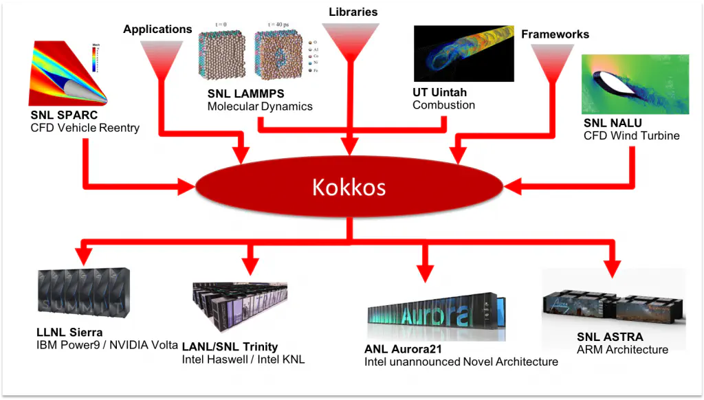
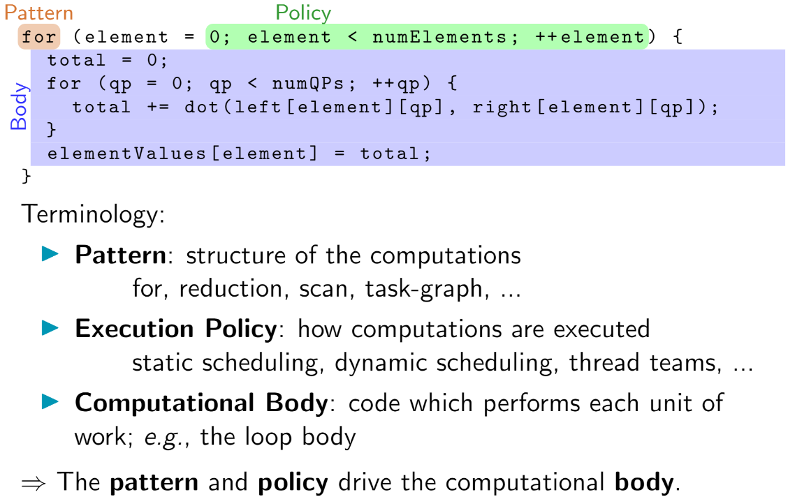

# KOKKOS 

Kokkos Core implementa un **modelo de programación** en C++ para escribir aplicaciones portátiles de alto rendimiento **dirigidas a las principales plataformas HPC**. Para ello, proporciona abstracciones tanto para la ejecución paralela de código como para la gestión de datos. Kokkos **está diseñado para arquitecturas de nodos complejas** con jerarquías de memoria de N niveles y múltiples tipos de recursos de ejecución. Actualmente puede utilizar CUDA, HIP, SYCL, HPX, OpenMP e hilos C++ como modelos de programación backend, con otras aplicaciones en el desarrollo.

**Kokkos Core es parte de "the Kokkos C++ Performance Portability Programming Ecosystem".**

El "Kokkos C++ Performance Portability Ecosystem" es una solución a nivel de producción para escribir aplicaciones modernas de hardware en C++ de forma agnóstica. Forma parte del proyecto Exascale del Departamento de Energía de EE.UU., un esfuerzo de este país para preparar a la comunidad de HPC para la próxima generación de plataformas de supercomputación. El ecosistema consta de múltiples bibliotecas que abordan las principales preocupaciones para el desarrollo y mantenimiento de aplicaciones de una manera portátil. Los tres componentes principales son el modelo de programación **Kokkos Core**, las bibliotecas matemáticas **Kokkos Kernels** y las herramientas de medición y depuración **Kokkos Profiling and Debugging Tools**.

### KOKKOS CORE

Kokkos Core es un modelo de programación para algoritmos paralelos que utilizan chips multinúcleo y memoria compartida entre esos núcleos. El modelo de programación incluye: 
 - **Abstracciones** de cálculo para patrones de cálculo paralelo de uso frecuente
 - **Políticas** que proporcionan detalles sobre cómo se aplican esos patrones de cálculo
 - **Espacios** de ejecución que indican en qué núcleos se realiza el cálculo paralelo. 
 - **Patrones** para estructuras de datos comunes
 - **Políticas** que proporcionan detalles sobre cómo se disponen esas estructuras de datos en la memoria 
 - **Espacios** de memoria que indican en qué memoria residen los datos 

 

 
 

El modelo de programación de Kokkos Core requiere que los equipos de desarrollo de aplicaciones implementen sus algoritmos en términos de patrones, políticas y espacios de Kokkos. Kokkos Core puede entonces mapear estos algoritmos en la arquitectura de destino de acuerdo con las reglas específicas de la arquitectura necesarias para lograr el mejor rendimiento. Mientras que otros modelos de programación admiten patrones de ejecución, políticas de ejecución, espacios de ejecución y espacios de memoria, Kokkos sólo admite patrones y políticas de datos, que son necesarios para la portabilidad del rendimiento.

### KOKKOS KERNELS

Kokkos Kernels es una **biblioteca de software de álgebra lineal y algoritmos de grafos** que se utiliza en muchas aplicaciones HPC para lograr el mejor (no sólo bueno) rendimiento en cada una de las arquitecturas. La base de esta biblioteca está escrita utilizando el modelo de programación Kokkos Core para lograr **portabilidad y un buen rendimiento**. La biblioteca cuenta con optimizaciones específicas de la arquitectura o utiliza versiones específicas del fabricante de estos algoritmos matemáticos cuando es necesario. Esto reduce la cantidad de software específico de la arquitectura que un equipo potencialmente necesita para desarrollar, reduciendo así aún más su coste de modificación para lograr el "mejor rendimiento de su clase".

### KOKKOS TOOLS

Kokkos Tools es una innovadora **interfaz de software "plug in" y un conjunto cada vez mayor de herramientas de medición del rendimiento y depuración** que se conectan a esa interfaz para que los equipos de desarrollo de aplicaciones analicen el rendimiento de ejecución y memoria de su software. Los equipos utilizan esta información sobre perfiles de rendimiento y depuración para determinar lo bien que han diseñado e implementado sus algoritmos y para identificar las partes de su software que puedens ser mejoradas. Las interfaces de Kokkos Tools aprovechan la interfaz del modelo de programación Kokkos Core para mejorar drásticamente la experiencia de los desarrolladores, al reenviar a las herramientas información específica de la aplicación y su contexto dentro del modelo de programación Kokkos Core.

**¿Quién está detrás del ecosistema de  KOKKOS**

**¿Qué ventajas me ofrece?**

Kokkos es un modelo de programación productivo, portable, funcional y con memoria compartida.

- Es una **librería** de C++, no un nuevo lenguaje o extensión
- Provee patrones de paralelización claros, concisos y escalables
- Pemite escribir algoritmos una vez y correrlos en **varias arquitecturas**, por ejemplo, CPU multicore, GPUs, Xeon Phi...
- Minimiza la cantidad de detalles de implementación de arquitecturas específicas que los usuarios deben aprender
- Resuelve el problema de la capa de datos usando arreglos multidimensionales con capas dependientes de arquitecturas 