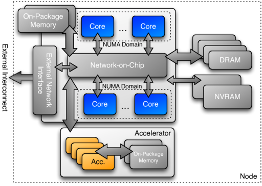
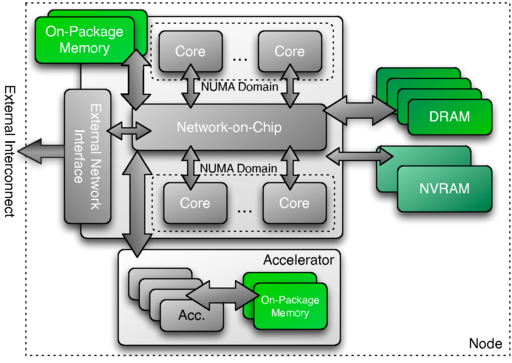
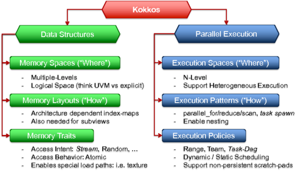

## Kokkos Abstract Machine Mode

Kokkos parte de un modelo abstracto de máquina para el diseño de futuras arquitecturas informáticas de memoria compartida. El modelo asume que puede haber múltiples unidades de ejecución en un nodo de computación. En la figura que se muestra aquí, hemos optado por mostrar dos tipos diferentes de unidades de cálculo: una que representa múltiples núcleos de latencia optimizada, similares a los núcleos de los procesadores actuales, y una segunda fuente de cálculo en forma de acelerador externo. Cabe destacar que el procesador y el acelerador tienen memorias distintas, cada una con propiedades de rendimiento únicas, que pueden o no ser accesibles en todo el nodo (es decir, la memoria puede ser accesible o compartida por todas las unidades de ejecución, pero también puede haber espacios de memoria específicos a los que sólo puedan acceder determinadas unidades de ejecución). La disposición específica mostrada en la figura 2.1 es una instanciación del modelo de máquina abstracta Kokkos utilizado para describir el potencial de múltiples tipos de motores de cálculo y memorias dentro de un único nodo. En los sistemas del futuro, los motores de ejecución que se utilicen en el nodo pueden ir desde un único tipo de núcleo, como en los procesadores multinúcleo actuales, hasta una serie de unidades de ejecución en las que los procesadores multinúcleo pueden unirse a numerosos tipos de núcleos aceleradores. Para garantizar la portabilidad a la gama potencial de nodos, se requiere una abstracción de los motores de cálculo y las memorias disponibles.

## KOKKOS SPACES

Kokkos utiliza el término espacios de ejecución para describir una agrupación lógica de unidades de cálculo que comparten un conjunto idéntico de propiedades de rendimiento. Un espacio de ejecución proporciona un conjunto de recursos de ejecución paralela que el programador puede utilizar utilizando varios tipos de operaciones paralelas fundamentales. El término espacios de memoria se utiliza para describir un recurso lógico de memoria distinto, que está disponible para asignar datos.

Una instancia de un espacio de ejecución es una instanciación específica de un espacio de ejecución al que un programador puede dirigir el trabajo paralelo. A modo de ejemplo, se puede utilizar un espacio de ejecución para describir un procesador multinúcleo. En este ejemplo, el espacio de ejecución contiene varios núcleos homogéneos que comparten alguna agrupación lógica. En un programa escrito según el modelo Kokkos, se dispondría de una instancia de este espacio de ejecución en la que se podrían ejecutar núcleos paralelos. Como segundo ejemplo, si añadiéramos una GPU al procesador multinúcleo de modo que el sistema dispusiera de un segundo tipo de espacio de ejecución, el programador de la aplicación dispondría de dos instancias de espacio de ejecución entre las que elegir. Lo importante aquí es que el modelo Kokkos abstrae el método de compilación de código para diferentes espacios de ejecución y el envío de kernels a las instancias. Esto permite a los programadores de aplicaciones no tener que escribir algoritmos en lenguajes específicos de hardware.

## KOKKOS MEMORY SPACES

Kokkos abstrae los múltiples tipos de memoria que estarán disponibles en los futuros nodos informáticos mediante espacios de memoria. Cada espacio de memoria proporciona una capacidad de almacenamiento finita a la que se puede asignar y acceder a estructuras de datos. Los distintos tipos de espacios de memoria tienen características diferentes en lo que respecta a la accesibilidad desde los espacios de ejecución, así como a sus características de rendimiento.

De la misma manera que los espacios de ejecución tienen instancias específicas a través de la disponibilidad de una instancia, lo mismo ocurre con los espacios de memoria. Una instancia de un espacio de memoria proporciona un método concreto para que el programador de la aplicación solicite asignaciones de almacenamiento de datos. Volviendo a los ejemplos proporcionados para los espacios de ejecución, el procesador multinúcleo puede tener múltiples espacios de memoria disponibles, incluyendo memoria en paquete, DRAM más lenta y conjuntos adicionales de memorias no volátiles. La GPU también puede proporcionar un espacio de memoria adicional a través de su memoria local on-package. El programador es libre de decidir dónde puede asignarse cada estructura de datos solicitándosela a la instancia específica asociada a ese espacio de memoria. Kokkos proporciona la abstracción adecuada de las rutinas de asignación y cualquier operación de gestión de datos asociada, incluyendo la liberación de la memoria, su devolución para uso futuro, así como para operaciones de copia.

# PROGRAMMING MODEL

El modelo de programación Kokkos se caracteriza por 6 abstracciones básicas: Espacios de Ejecución, Patrones de Ejecución, Políticas de Ejecución, Espacios de Memoria, Disposición de Memoria y Rasgos de Memoria. Estos conceptos de abstracción permiten formular algoritmos y estructuras de datos genéricos que pueden adaptarse a distintos tipos de arquitecturas. En efecto, permiten transformar los algoritmos en tiempo de compilación para adaptarlos a distintos grados de paralelismo del hardware, así como a la jerarquía de memoria.

## Execution Spaces

Un Espacio de Ejecución es el lugar donde se puede ejecutar el código. Por ejemplo, en los actuales sistemas híbridos GPU/CPU existen dos tipos de espacios de ejecución: los núcleos de la GPU y los núcleos de la CPU. En el futuro, esto podría incluir módulos de procesamiento en memoria (PIM) o distintos tipos de núcleos en una CPU heterogénea. En principio, esto también puede utilizarse para introducir espacios de memoria remotos, por ejemplo, la capacidad de enviar trabajo a un nodo diferente. De este modo, los Espacios de Ejecución ofrecen a los desarrolladores de aplicaciones los medios para dirigirse a diferentes partes de una arquitectura de hardware heterogénea. Esto se corresponde directamente con el modelo de máquina descrito anteriormente.

## Execution Patterns

Los patrones de ejecución son los algoritmos paralelos fundamentales en los que debe expresarse una aplicación. Algunos ejemplos son:

- `parallel_for()`: ejecuta una función en un orden indeterminado un número determinado de veces
- `parallel_reduce()`: combina las ejecuciones de *parallel_for()* con una operación de reducción
- `parallel_scan()`: combina una operación del *parallel_for()* con un escaneo prefijo o sufijo de los valores de salida de cada operación
- `task`: Ejecuta una sola función con dependencias en otras funciones

Expresar una aplicación en estos patrones permite a la implementación subyacente o al compilador utilizado razonar sobre transformaciones válidas. Por ejemplo, todos los patrones parallel_*** permiten un orden de ejecución no especificado y sólo prometen resultados deterministas de las propias reducciones. Esto permite diferentes patrones de mapeo en diferentes hardware, como la asignación de iteraciones a hilos o carriles vectoriales.

## Execution Policies 

Una politica de ejecución determina junto un patrón de ejecución cómo una función es ejecutada.

### Range Policies

La forma más simple de políticas de ejecución son las Políticas de Rango. Se utilizan para ejecutar una operación una vez por cada elemento de un rango. No hay prescripciones de orden de ejecución o concurrencia, lo que significa que no es legal sincronizar diferentes iteraciones.

### Team Policies

Las políticas de equipo se utilizan para implementar el paralelismo jerárquico. Para ello, Kokkos agrupa los hilos en equipos. Un equipo de hilos es una colección de uno o más «hilos» paralelos de ejecución. Kokkos permite un número arbitrario de equipos: el tamaño de la liga. El hardware limita el número de hilos de un equipo (el tamaño del equipo). Se garantiza que todos los hilos de un equipo se ejecuten simultáneamente.

## Memory Spaces

Los espacios de memoria son los lugares donde residen los datos. Especifican la ubicación física de los datos, así como determinadas características de acceso. Las distintas ubicaciones físicas corresponden a elementos como la memoria de gran ancho de banda, la memoria de memoria virtual en el chip o el almacenamiento masivo no volátil. Los diferentes espacios de memoria lógica permiten conceptos como la memoria UVM en el modelo de programación CUDA, a la que se puede acceder desde el host y la GPU. Los espacios de memoria también podrían utilizarse en el futuro para expresar ubicaciones de memoria remotas. Además, encapsulan funcionalidades como el control de consistencia y los ámbitos de persistencia.

## Memory Layout

Las disposiciones expresan la correspondencia entre los índices lógicos (o algorítmicos) y el desplazamiento de direcciones para una asignación de datos. Adoptando las disposiciones adecuadas para las estructuras de memoria, una aplicación puede optimizar los patrones de acceso a los datos en un algoritmo determinado. Si una implementación proporciona disposiciones polimórficas (es decir, una estructura de datos puede instanciarse en tiempo de compilación o de ejecución con diferentes disposiciones), puede realizarse una optimización dependiente de la arquitectura.

## Memory Traits

Los rasgos de memoria especifican cómo se accede a una estructura de datos en un algoritmo. Los rasgos expresan escenarios de uso como el acceso atómico, el acceso aleatorio y las cargas o almacenamientos en flujo. Al poner estos atributos en las estructuras de datos, una implementación del modelo de programación puede insertar operaciones óptimas de carga y almacenamiento. Si un compilador implementa el modelo de programación, podría razonar sobre los modos de acceso y utilizarlos para informar de las transformaciones del código.
